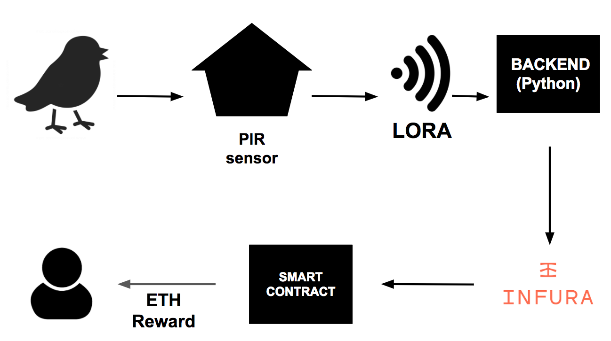

# Blockchain connected bird feeder

Birdy is bird feeder located in [Paper Hub](http://paperhub.cz/) which will pay you Ethereum for birds attracted by your feed.
It has its own [Smart Contract](https://kovan.etherscan.io/address/0xe55E2c3A123dc770Af42eeDF8c2abDBF1B96b618).



## Data Processor

This is HTTP hook which gets called by LoRa provider, when Birdy sends some data.
It calls [Smart Contract](https://kovan.etherscan.io/address/0xe55E2c3A123dc770Af42eeDF8c2abDBF1B96b618), downloads latest weather data and submit new data to [Google Spreadsheet](https://docs.google.com/spreadsheets/d/1b-I_sqDUSi4DLrNH9eQgt1vGZ0ZJme892QrYkxmm1eg/edit#gid=0)

How to run it :
```
pip install weather-api gspread oauth2client Flask-HTTPAuth ethereum
python3 -m data_processor
```

## Smart Contract

TBC

